# Supplementary Diagrams
## Phone Call Detection System

**Document Version:** 1.0  
**Date:** 2026-01-26  
**Project:** iOS Phone Call Fraud Detection Feature

---

## 1. Class Diagram

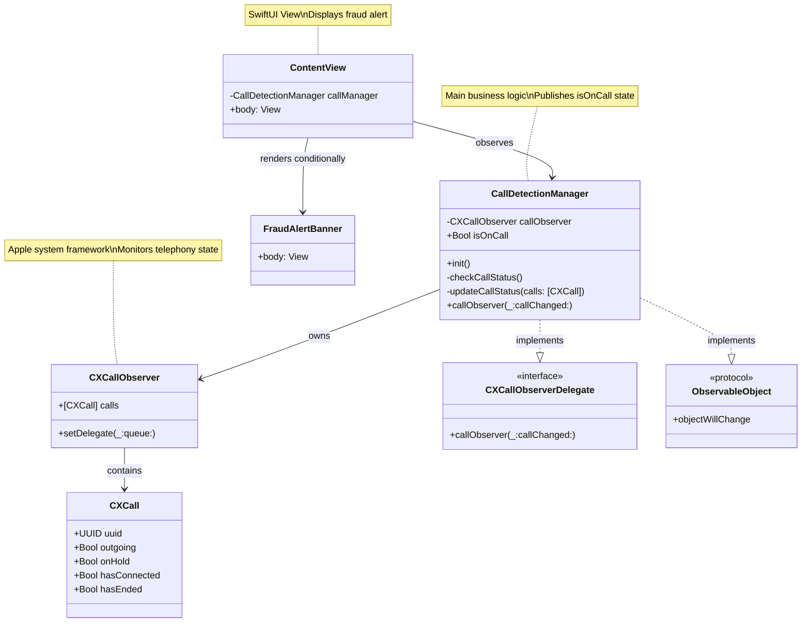

---

## 2. Deployment Diagram

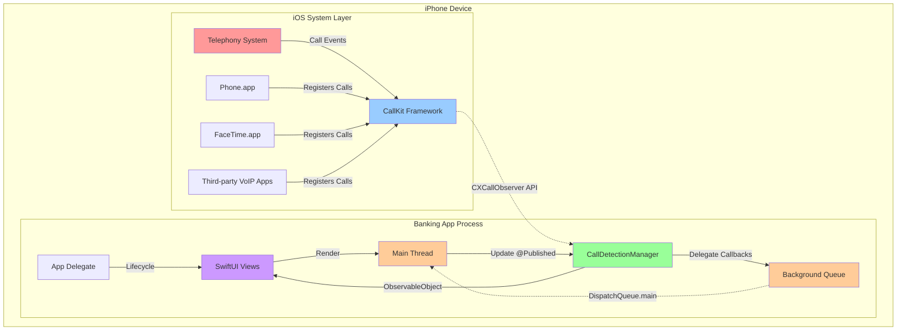

---

## 3. Component Diagram

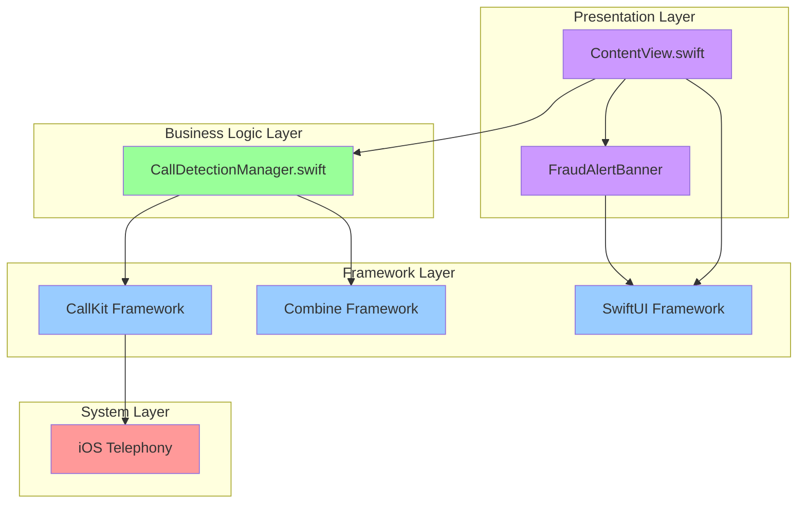

---

## 4. Data Flow Diagram

```mermaid
flowchart LR
    A[Telephony Event] -->|1. Call State Change| B[CallKit]
    B -->|2. Notify Observer| C[CXCallObserver]
    C -->|3. Delegate Callback| D[CallDetectionManager]
    D -->|4. Fetch Call Array| C
    C -->|5. Return [CXCall]| D
    D -->|6. Evaluate State| E{Any !hasEnded?}
    E -->|Yes| F[Set isOnCall = true]
    E -->|No| G[Set isOnCall = false]
    F -->|7. Publish Change| H[Combine Framework]
    G -->|7. Publish Change| H
    H -->|8. Notify Subscribers| I[SwiftUI View]
    I -->|9. Re-render| J[Display/Hide Banner]
    
    style A fill:#ff9999
    style B fill:#99ccff
    style C fill:#99ccff
    style D fill:#99ff99
    style E fill:#ffffcc
    style H fill:#99ccff
    style I fill:#cc99ff
    style J fill:#cc99ff
```

---

## 5. State Diagram (Call Lifecycle)

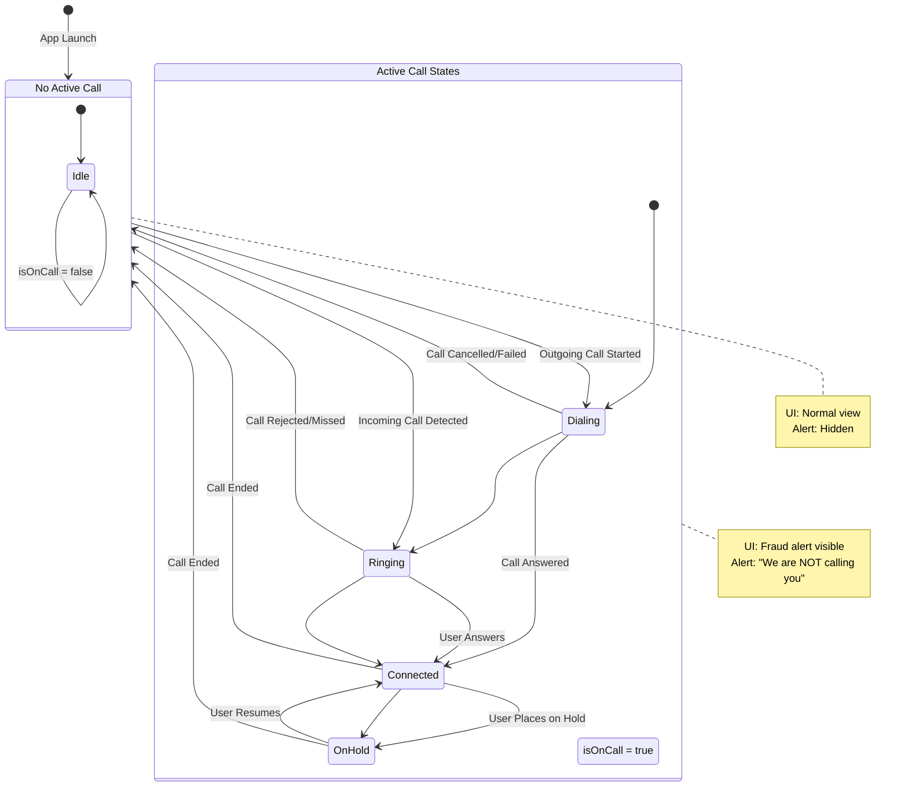

---

## 6. Activity Diagram (Manager Initialization)

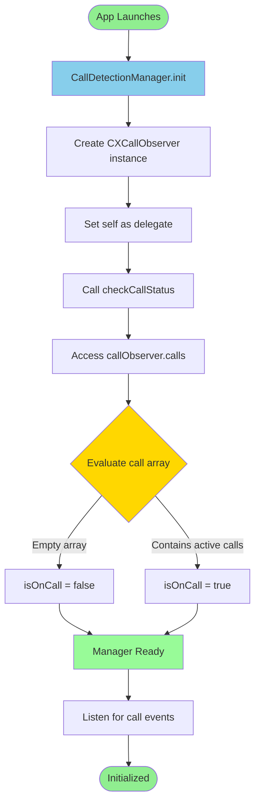

---

## 7. Timing Diagram (Call Event Processing)

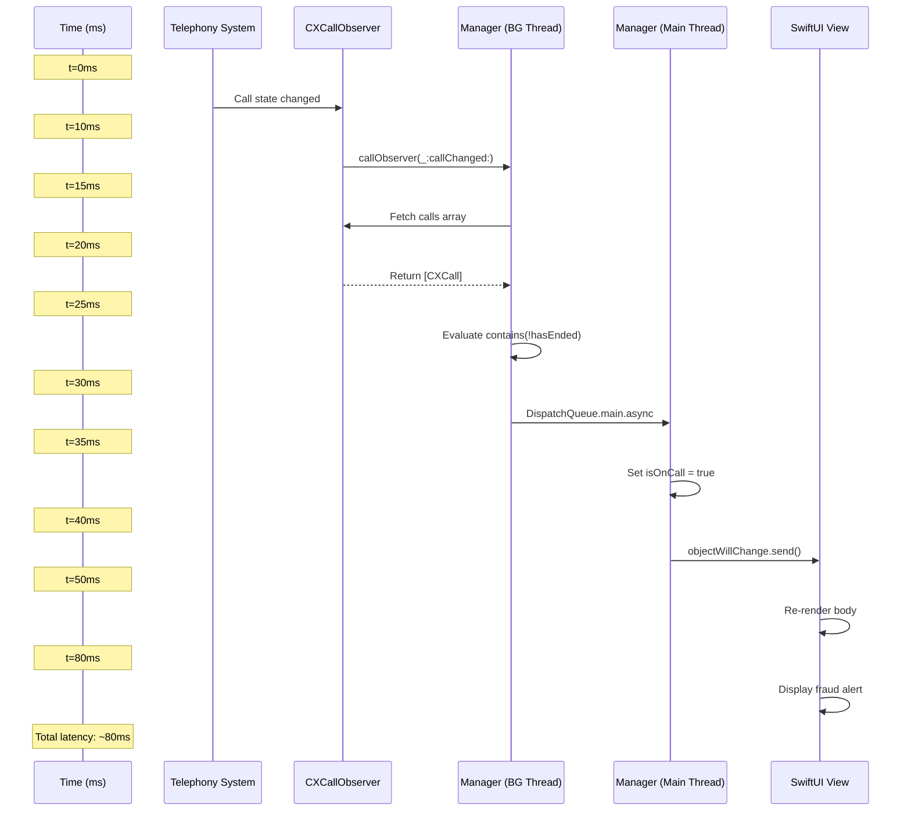

---

## 8. Use Case Diagram

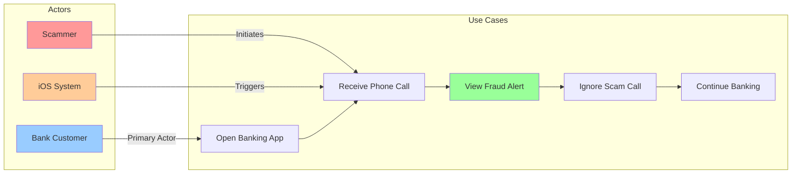

---

## 9. Package Diagram (Module Structure)

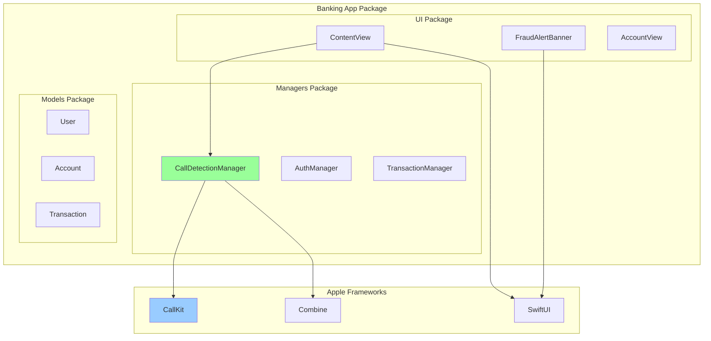

---

## 10. Network Diagram (System Context)

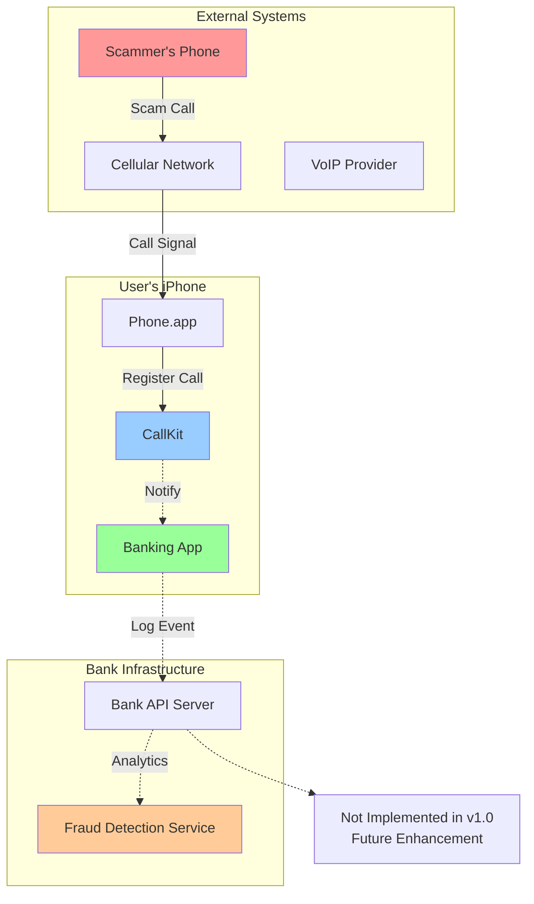

---

## 11. Memory Layout Diagram

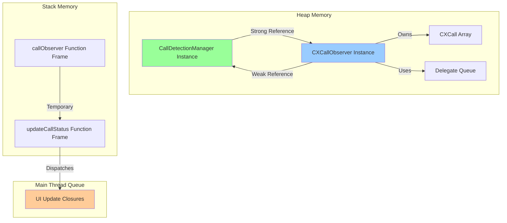

---

## 12. Thread Interaction Diagram

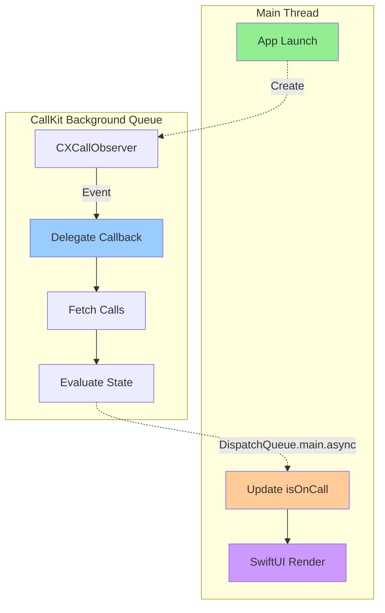

---

## 13. Ecosystem Diagram

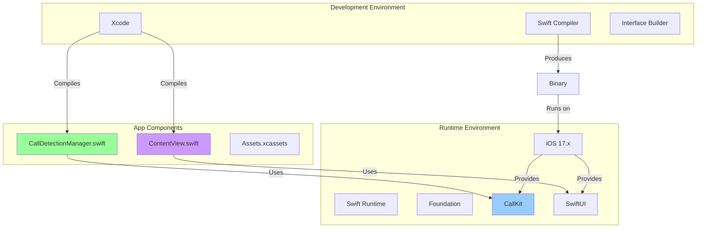

---

## 14. Decision Tree (Implementation Choices)

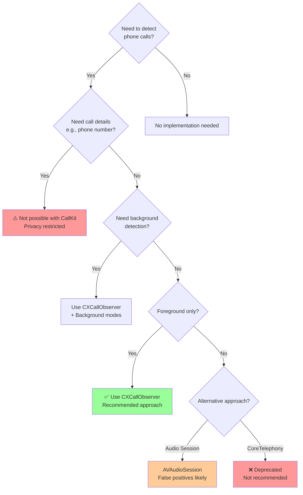

---

## 15. Error Handling Flow

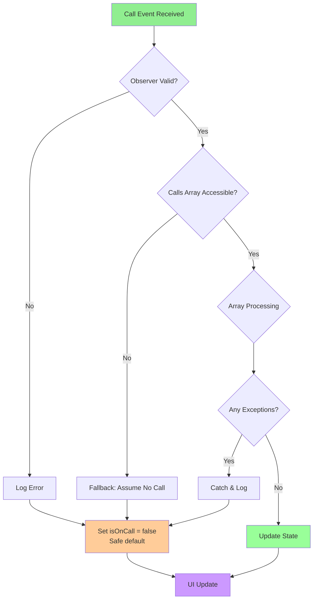

---

## 16. Architecture Layers Diagram

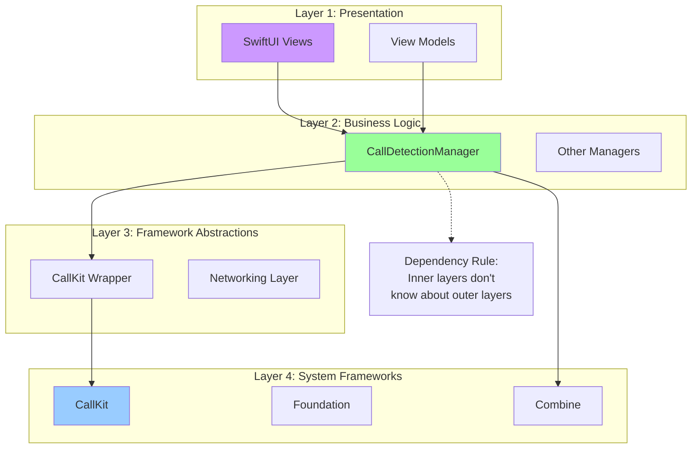

---

## Legend

### Color Coding
- 🟩 **Green** (#99ff99): Application code (our implementation)
- 🟦 **Blue** (#99ccff): Apple frameworks & system components
- 🟪 **Purple** (#cc99ff): UI/View layer
- 🟧 **Orange** (#ffcc99): Threading/Async components
- 🟥 **Red** (#ff9999): External/Untrusted components
- 🟨 **Yellow** (#ffcc99): Decision points/Warnings

### Diagram Types
- **Sequence Diagrams**: Show time-ordered interactions
- **Class Diagrams**: Show static structure
- **Flowcharts**: Show logic/process flow
- **State Diagrams**: Show state transitions
- **Deployment**: Show physical architecture
